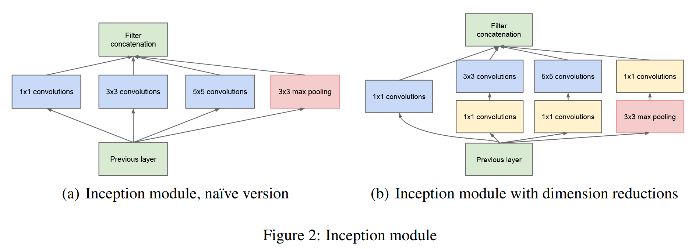
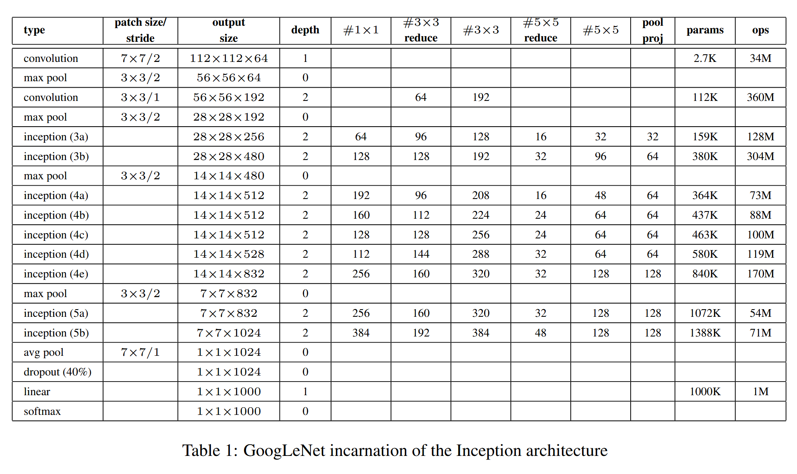
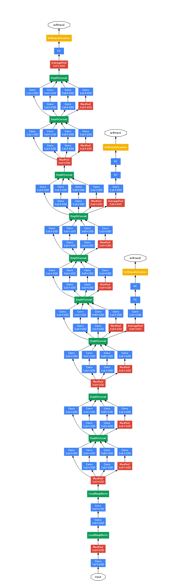

# GoogLeNet

Link: [Going Deeper with Convolutions](http://arxiv.org/abs/1409.4842).

> We propose a deep convolutional neural network architecture codenamed **Inception**, which was responsible for setting the new **state of the art** for classification and detection in the ImageNet Large-Scale Visual Recognition Challenge 2014 (ILSVRC14). The main hallmark of this architecture is the improved utilization of the computing resources inside the network. This was achieved by a carefully crafted design that allows for increasing the depth and width of the network while keeping the computational budget constant. To optimize quality, the architectural decisions were based on the Hebbian principle and the intuition of multi-scale processing. One particular incarnation used in our submission for ILSVRC14 is called **GoogLeNet**, a 22 layers deep network, the quality of which is assessed in the context of classification and detection.

## Background

提升模型性能的**最直接**方法就是增加模型的参数量，即增加模型的深度和宽度。本文提出了一个 **Inception** 的结构，基于 Inception 的具有 22 层的 **GoogLeNet** 取得了 ILSVRC 2014 分类和检测比赛的第一名，参数量仅仅为 [**AlexNet**](https://papers.nips.cc/paper_files/paper/2012/file/c399862d3b9d6b76c8436e924a68c45b-Paper.pdf) 的 1/12，但性能却得到的显著的提升。本文旨在构建一个**高效**的卷积神经网络，就是通过**更少的参数量**达到更好的结果，同时，更少的参数量也意味着网络的推理速度更快。

下图为 Inception 模块的结构图，图 (a) 是一个比较 naive 的版本，Inception 模块共有 4 条**并行**的路径，分别执行 1x1 卷积、3x3 卷积、5x5 卷积、3x3 最大池化，每个路径得到的特征图的空间大小相同，直接**按通道维度连接**起来得到最终的输出。图 (b) 和图 (a) 的区别在于执行 3x3 卷积、5x5 卷积之前进行了一次 1x1 卷积，目的是使得通道**维度降低**（channels reduction），从而**降低计算量**的目的，此外，3x3 最大池化层后也添加了一个 1x1 卷积，目的也是降低计算量。

## Model Architecture

GoogLeNet 模型的详细结构如下表所示：

所有的卷积层后均跟着一个 ReLU 激活函数。#3x3 reduce 和 #5x5 reduce 表示 Inception 模块中 3×3 和 5×5 卷积之前使用的**降维层**中 1×1 卷积核的数量，pool proj 表示 3x3 最大池化层后的 1x1 卷积的卷积核数量。

完整的 GoogLeNet 模型结构如下图所示，具有两个**辅助分类器**（auxiliary classifer），分别连接到网络中间层输出的特征图，作用是**增加传播回来的梯度信号**，避免模型训练时执行反向传播时，浅层的梯度较小，导致浅层无法学习，训练时两个辅助分类器的**损失权重为 0.3**，**在测试时不考虑这两个辅助分类器的结果**。

辅助分类器的结构为：

- 步长为 3 的 5x5 **平均池化层**。
- 128 个卷积核的 **1x1 卷积**，降低通道维度，后面跟一个 ReLU 激活函数。
- 具有 1024 单元的**全连接层**，后跟一个 ReLU 激活函数。
- **Dropout 层**，dropout 比例为 70%
- 具有 `num_classes` 个单元的**全连接层**。

所有的分类器（包括两个辅助分类器）都使用**交叉熵函数**（Cross Entropy）作为损失函数。

