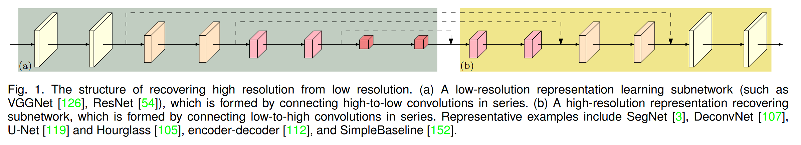
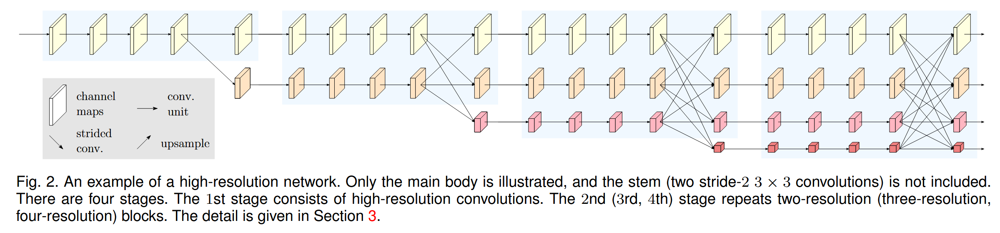
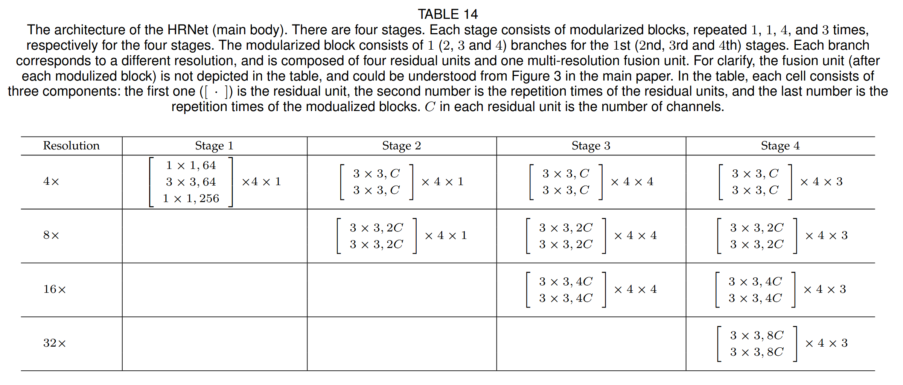
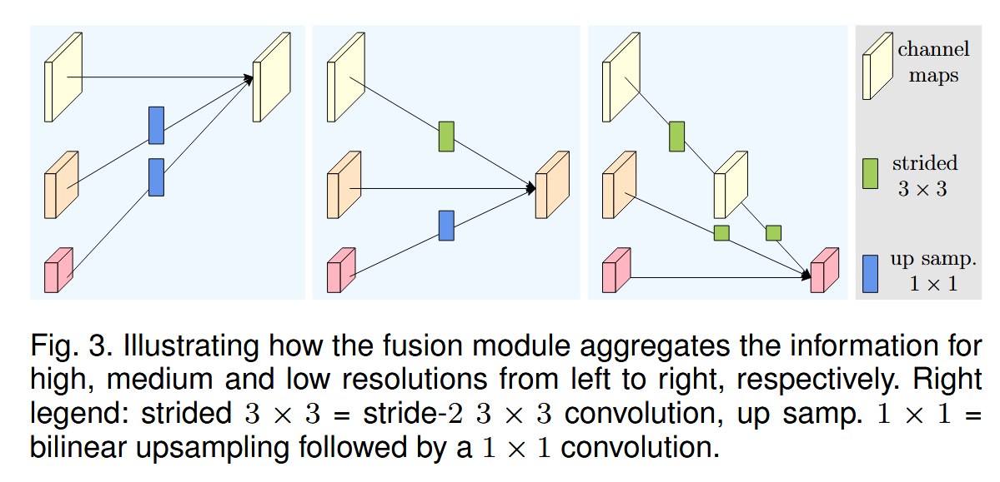
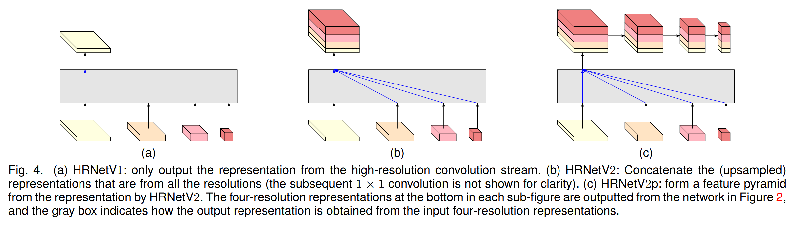

# HRNet

Link: [Deep High-Resolution Representation Learning for Visual Recognition](http://arxiv.org/abs/1908.07919).

> **High-resolution representations are essential for position-sensitive vision problems**, such as human pose estimation, semantic segmentation, and object detection. Existing state-of-the-art frameworks first encode the input image as a low-resolution representation through a subnetwork that is formed by connecting high-to-low resolution convolutions in series (e.g., ResNet, VGGNet), and then recover the high-resolution representation from the encoded low-resolution representation. Instead, our proposed network, named as **High-Resolution Network** (HRNet), maintains high-resolution representations through the whole process. There are two key characteristics: (i) Connect the high-to-low resolution convolution streams in **parallel**; (ii) Repeatedly exchange the information across resolutions. The benefit is that the resulting representation is semantically richer and spatially more precise. We show the superiority of the proposed HRNet in a wide range of applications, including human pose estimation, semantic segmentation, and object detection, suggesting that the HRNet is a stronger backbone for computer vision problems. All the codes are available at https://github.com/HRNet.

## Background

深度卷积神经网络（DCNNs）在许多计算机视觉任务中达到了最先进的性能，例如图像分类、目标检测、语义分割。典型的分类网络如 AlexNet、VGG Net、GoogLeNet、ResNet，都遵循了 LeNet-5 的设计原则：逐渐地降低特征图的空间维度大小，逐步扩大特征图的通道维度，**串联**连接从高分辨率到低分辨率的卷积，并产生**低分辨率表示**（Low-Resolution Representation），进一步处理以进行分类。

位置敏感的任务需要**高分辨率表示**（High-Resolution Representation），例如：语义分割、目标检测等。以前最好的方法是采用**高分辨率恢复过程**来提高分类网络输出的低分辨率表示的表示分辨率，例如：U-Net。此外，通过**膨胀卷积**（Dilated Convolution）可以替换掉部分降采样操作（Strided-Convolution and Pooling），因此获得**中等分辨率表示**（Medium-resolution Representation）。

作者提出了一个新的模型结构，称为**高分辨率网络**（High-Resolution Net），能够在整个过程中保持高分辨率的表示。HRNet 从一个高分辨率卷积流开始，逐渐添加高分辨率到低分辨率的卷积流，并**连接**多分辨率的并行卷积流，网络包含 4 个阶段，其中第 i 个阶段包含 i 个卷积流，通过一次次地交换并行卷积流中的信息来进行重复的**多分辨率融合**。

从 HRNet 中学习到的高分辨率表示不仅**语义丰富**，而且**空间精确**。原因来自于两个方面：

1. HRNet 并行而不是串联连接高分辨率到低分辨率的卷积流，能够**保持高分辨率**，而不是从低分辨率恢复高分辨率，因此学习到的表示在空间上更加精确。
2. HRNet 执行多分辨率融合不仅可以**利用低分辨率的表示来增强高分辨率表示的语义信息**，而且也可以**用高分辨率表示来增强低分辨率表示的空间信息**。

## Model Architecture

首先将图片进行两次步长为 2 的 3x3 卷积，将其分辨率降为原来的 1/4，HRNet 包含**并行的多分辨率卷积流、重复的多分辨率融合、表示头**。HRNet 的其中一个版本的**主体结构**如下图所示：

HRNet 共有 4 个阶段，第 i 个阶段的结束都会从第 i 个卷积流输出的特征图进行**降采样**（通过步长为 2 的 3x3 卷积实现），获取**分辨率为 1/2** 的表示，同时特征图的**通道数变为原来的 2 倍**。

详细的 HRNet 主体结构如下表所示：

一个模块由 4 个残差块（Residual Block）以及 1 个多分辨率融合模块组成，在阶段 1、2、3、4 分别共有 1、1、4、3  个这样的模块。

### Feature Funsion Module

HRNet 的**特征融合模块**如下图所示，进行特征融合时，每一条并行卷积流都要保持特征图的分辨率相同，因此合并其他分辨率时需要进行**上采样或者下采样**的操作来**提高或降低**原始特征图的分辨率，上采样操作就是通过**双线性插值**（Bilinear Interpolation）以及 1x1 卷积实现，而下采样操作就是通过若干个步长为 2 的 3x3 卷积操作实现。

### Representation Heads

HRNet 中共有三种不同的表示头，分别为：HRNetV1、HRNetV2、HRNetV2p。

- **HRNetV1**：输出的表示仅来源于高分辨率卷积流的输出。

- **HRNetV2**：通过双线性插值上采样低分辨率表示，并通过 1x1 的卷积（**不改变通道数**），将四种表示连接起来后通过 1x1 卷积进行融合。
- **HRNetV2p**：通过将 HRNetV2 的高分辨率表示输出下采样（**通过步长为 2 的 3x3 卷积**）到多个级别来**构建多级表示**。

作者应用 HRNetV1 在**人类姿势估计**任务，将 HRNetV2 应用于**语义分割任务**，将 HRNetV2p 应用于**目标检测任务**，并取得了最先进的性能。

