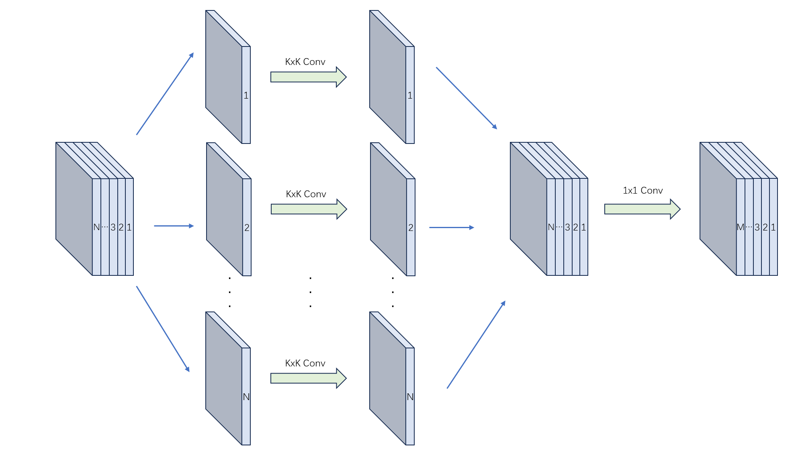
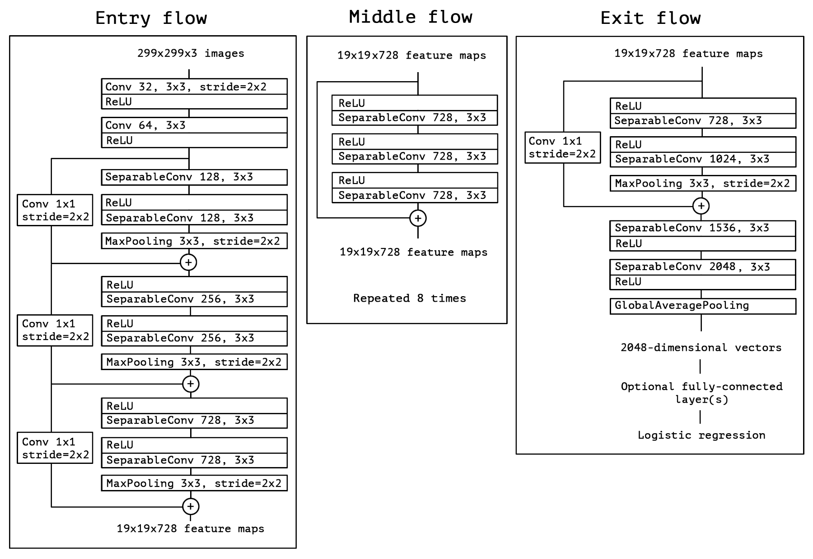

# Xception

Link: [Xception: Deep Learning with Depthwise Separable Convolutions](http://arxiv.org/abs/1610.02357).

> We present an interpretation of Inception modules in convolutional neural networks as being an intermediate step in-between regular convolution and the **depthwise separable convolution** operation (**a depthwise convolution followed by a pointwise convolution**). In this light, a depthwise separable convolution can be understood as an Inception module with a maximally large number of towers. This observation leads us to propose a novel deep convolutional neural network architecture inspired by Inception, where Inception modules have been replaced with depthwise separable convolutions. We show that this architecture, dubbed **Xception**, slightly outperforms Inception V3 on the ImageNet dataset (which Inception V3 was designed for), and significantly outperforms Inception V3 on a larger image classification dataset comprising 350 million images and 17,000 classes. Since the Xception architecture has the same number of parameters as Inception V3, the performance gains are not due to increased capacity but rather to a **more efficient use of model parameters**.


## Background

基于 **Inception** 结构的基础上，将 Inception 模块中的标准卷积替换为**深度可分离卷积**（Depthwise Separable Convolution），作者提出了 **Xception**，Xception 与 [Inception V3](http://arxiv.org/abs/1512.00567) 具有相同的参数量，但是 Xception 的性能却更好，性能提升的原因是 Xception **更高效**地使用模型的参数。


### Depthwise Separable Convolution

**深度可分离卷积**可分为两个步骤：

1. 将输入特征图**按通道分离**，对每个通道进行一次标准卷积操作，然后**按通道合并**卷积结果。
2. 进行一次 **1x1 标准卷积**。

在按深度卷积（depthwise convolution）后，进行 1x1 标准卷积的作用：

1. 进行**特征融合**操作。
2. 调整输出特征图的通道数。




假设有一个形状为 **(N, H, W)** 的输入特征图（**N 为通道数**），**M 个**形状为 **(F, F)** 卷积核，分别进行步长为 **S** 的标准卷积和深度可分离卷积操作，下面对比这两种卷积操作的计算复杂度（**只统计乘法个数**）。

我们根据如下公式计算出卷积后输出特征图的空间大小：
$$
H_{out}=\frac{H_{in}-F+2P}{S}+1\\
W_{out}=\frac{W_{in}-F+2P}{S}+1\\
$$
显然两种卷积输出的特征图大小是一致的。

**标准卷积计算量**：
$$
H_{out}\times W_{out} \times F^2 \times N\times M
$$
**深度可分离卷积计算量**：
$$
H_{out}\times W_{out} \times F^2 \times N +H_{out}\times W_{out}\times N\times M\\=H_{out}\times W_{out}\times N \times(F^2+M)
$$
因此深度可分离卷积的计算量是标准卷积计算量的：
$$
\frac{1}{M} + \frac{1}{F^2}
$$


## Model Architecture

基于深度可分离卷积以及 Inception 结构，作者提出了 Xception（**Extreme Inception**）结构，模型结构如下图所示：



所有的卷积和深度可分离卷积操作后均使用了**批量归一化**（Batch Normalization），在 Xception 的结构中使用了**残差连接**（Residual Connection）。


## Implementation

**深度可分离卷积**操作的 PyTorch 实现：

```python
class DepthwiseSeparableConv2d(nn.Module):
    """Depthwise Separable Convolution."""
    def __init__(self, in_channels: int, out_channels: int, kernel_size: int=1, 
                 stride: int=1, padding: int=0, dilation: int=1) -> None:
        super(DepthwiseSeparableConv2d, self).__init__()
        # depthwise convolution
        self.depthwise_conv = nn.Conv2d(in_channels, in_channels, 
                                        kernel_size=kernel_size, stride=stride, 
                                        padding=padding, dilation=dilation, 
                                        groups=in_channels)
        # pointwise convolution
        self.pointwise_conv = nn.Conv2d(in_channels, out_channels, kernel_size=1, stride=1, padding=0)
    
    def forward(self, x: Tensor):
        out = self.depthwise_conv(x)
        out = self.pointwise_conv(out)
        return out
```

