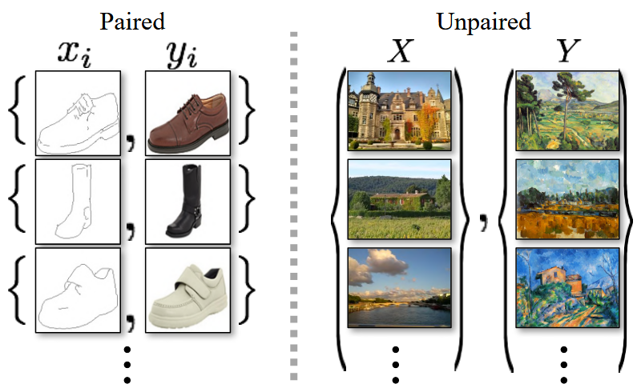
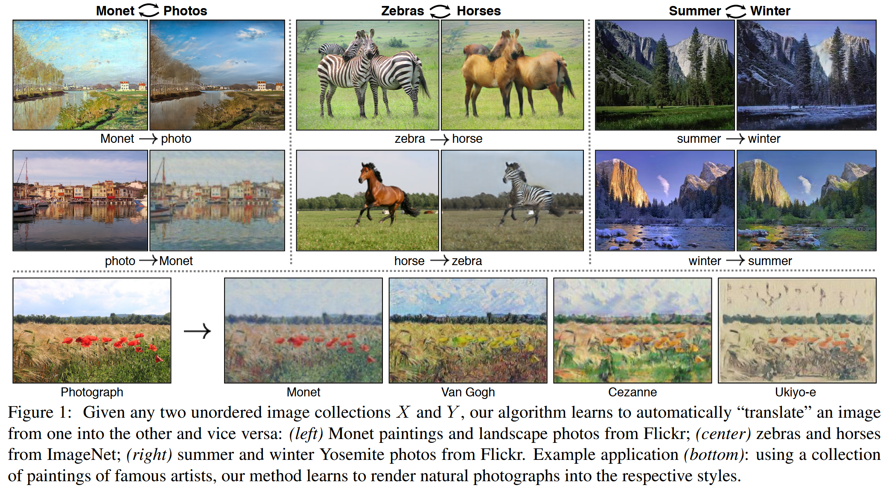
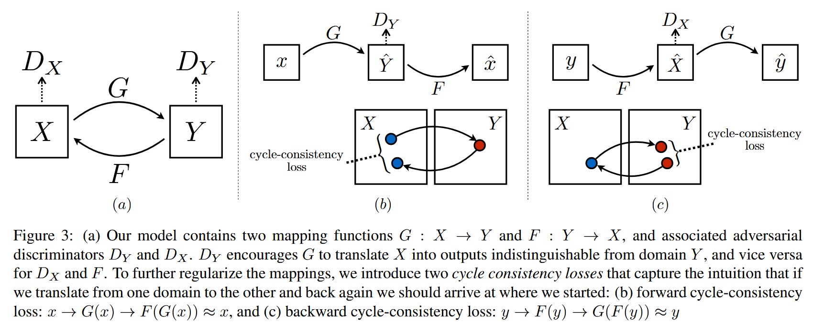
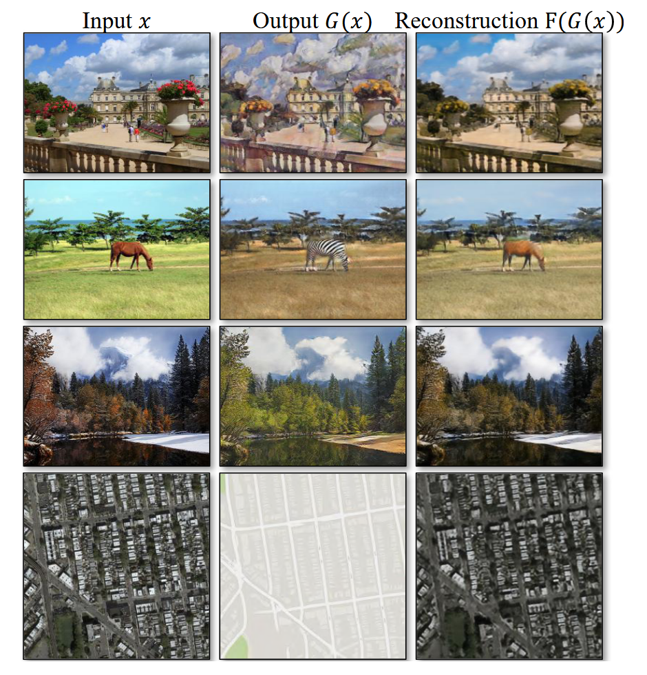
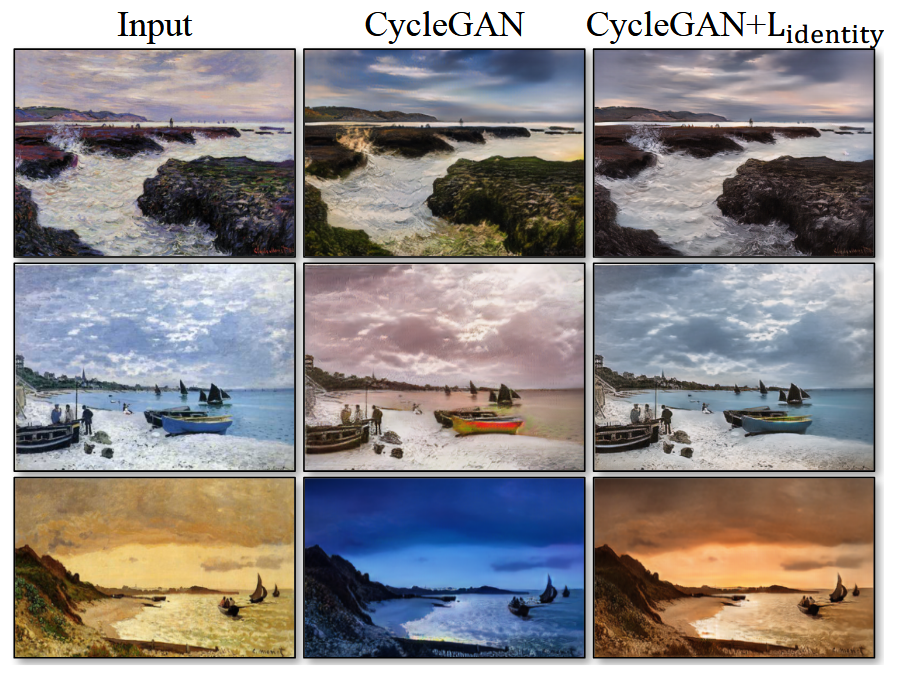

# CycleGAN

Link: [Unpaired Image-to-Image Translation using Cycle-Consistent Adversarial Networks](http://arxiv.org/abs/1703.10593).

> **Image-to-image translation** is a class of vision and graphics problems where **the goal is to learn the mapping between an input image and an output image** using a training set of aligned image pairs. However, for many tasks, paired training data will not be available. We present an approach for learning to translate an image from a source domain X to a target domain Y in the absence of paired examples. Our goal is to learn a mapping G : X → Y such that the distribution of images from G(X) is indistinguishable from the distribution Y using an adversarial loss. Because this mapping is highly under-constrained, we couple it with an inverse mapping F : Y → X and introduce a cycle consistency loss to enforce F (G(X)) ≈ X (and vice versa). Qualitative results are presented on several tasks where paired training data does not exist, including collection style transfer, object transfiguration, season transfer, photo enhancement, etc. Quantitative comparisons against several prior methods demonstrate the superiority of our approach.

## Background

**图像到图像转换**（Image-to-Image Translation）是一类计算机视觉问题，其目标是使用**对齐的图像对**（aligned image pairs）的训练集来学习**输入图像和输出图像之间的映射**。然而，对齐的图像对通常是比较难获取的。作者提出了一种方法：**Cycle-GAN**，使得在不使用对齐的图像对的条件下，也能够学习到这种映射。

大致的方法是使用两个生成器 G、F，其中生成器 G 用来学习 X 到 Y 的映射，而生成器 F 用来学习 Y 到 X 的映射（**G的逆映射**），并且引入了一个**循环一致性损失**（Cycle Consistency Loss）来满足约束条件 **F(G(x)) ≈ x** 以及 **G(F(y)) ≈ y**。

**Cycle GAN 的官方 Github 仓库链接：https://github.com/junyanz/pytorch-CycleGAN-and-pix2pix**

下图展现了具有对齐图像对和没有对齐图像对的数据集的区别：

下图展现了 Cycle GAN 的一些结果：

## Method

### Formulation

我们的目标是在给定训练样本 $\lbrace x_1, x_2,\dots, x_N\rbrace$（其中 $x_i\in X$） 以及 $\lbrace y_1, y_2,\dots, y_M\rbrace$（其中 $y_j\in Y$）的情况下**学习两个域 X 和 Y 之间的映射函数**。Cycle GAN 包含**两个生成器**（$G:X \to Y$、 $F: Y \to X$），此外还引入了**两个辨别器** Dx 和 Dy，辨别器 Dx 用来区分真实数据 **x** 和假数据 **F(y)**，辨别器 Dy 用来区分真实数据 **y** 和假数据 **G(x)**。

同时，除了**对抗损失**（Adversarial Loss）之外，Cycle GAN 还引入了**循环一致性损失**，保证 F 和 G 互为逆映射。

### Loss Functions

完整的损失函数包含两个部分：**对抗损失和循环一致性损失**。
$$
L(G,F,D_X,D_Y)=L_{GAN}(G,D_Y,X,Y)+L_{GAN}(F,D_X,Y,X)+\lambda L_{cyc}(G,F)
$$

#### Adversarial Loss

原始 [GAN](https://papers.nips.cc/paper_files/paper/2014/hash/5ca3e9b122f61f8f06494c97b1afccf3-Abstract.html) 的**损失函数**（mini-max loss）为：
$$
L_{GAN}(G,D_Y,X,Y)=E_{y}[\log D_Y(y)]+E_x[\log(1-D_Y(G(x)))]
$$
对于生成器而言，要**最小化** $L_{GAN}$，对于辨别器而言，要**最大化** $L_{GAN}$。

在实际的实现中，使用的是[**最小二乘损失**](http://arxiv.org/abs/1611.04076)（Least-Squares Loss），这种使得训练更加稳定，生成图片的质量更高。特别地，**生成器需要最小化**：
$$
E_x[(D(G(x)) - 1)^2]
$$
**辨别器需要最小化**：
$$
E_y[(D(y)-1)^2]+E_x[D(G(x))^2]
$$

#### Cycle Consistency Loss

仅仅通过对抗损失，生成器可以学习到两个数据分布之间的映射关系，**但是不能确保生成的结果与输入是配对的**。**循环一致性损失 **用来降低这种不配对的可能性，循环一致性损失为：
$$
L_{cyc}(G,F)=E_x[||F(G(x)) - x||_1]+E_y[||G(F(y))-y||_1]
$$

#### Identity Mapping Loss

通过添加一个**等值映射损失**对于保留输入和输出之间的颜色一致性等具有帮助。
$$
L_{identity}(G,F)=E_x[||G(y)-y||_1]+E_y[||F(x)-x||_1]
$$
下图是原图 CycleGAN 生成的结果以及结合了等值映射损失生成的结果对比，可以观察到添加了等值映射损失后，生成的图片与原图的颜色具有**一致性**，而CycleGAN 则缺乏这种能力。

