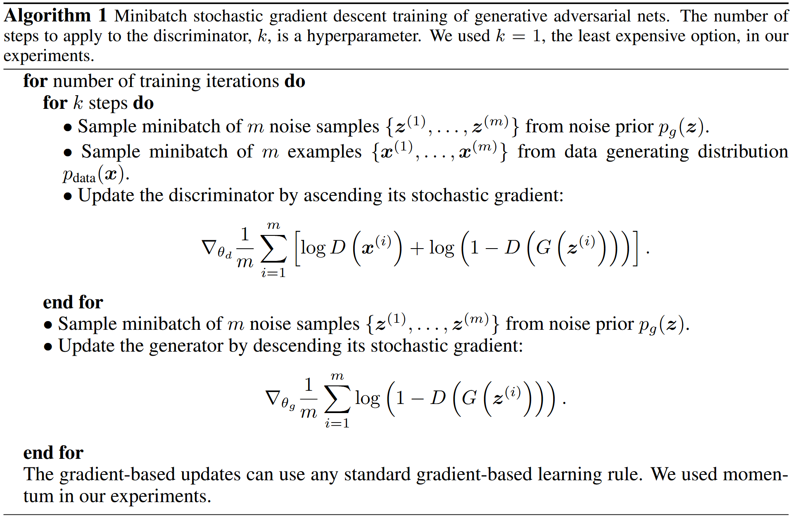

# Deep Convolutional Generative Adversarial Networks

Link: [Unsupervised Representation Learning with Deep Convolutional Generative Adversarial Networks](http://arxiv.org/abs/1511.06434).

> In recent years, supervised learning with convolutional networks (CNNs) has seen huge adoption in computer vision applications. Comparatively, unsupervised learning with CNNs has received less attention. In this work we hope to help bridge the gap between the success of CNNs for supervised learning and unsupervised learning. We introduce a class of CNNs called **deep convolutional generative adversarial networks** (DCGANs), that have certain architectural constraints, and demonstrate that they are a strong candidate for unsupervised learning. Training on various image datasets, we show convincing evidence that our deep convolutional adversarial pair learns a hierarchy of representations from object parts to scenes in both the generator and discriminator. Additionally, we use the learned features for novel tasks - demonstrating their applicability as general image representations.


## Model Architecture

稳定的 DCGAN 的**架构指南**：

- 将任何**池化层**替换为步长卷积（辨别器）和分数步长卷积（生成器）。
- 在生成器和辨别器中均使用**批量归一化**（Batch Normalization）。
- **删除全连接隐藏层**以获得更深的架构。
- 在生成器中，除了输出层使用 Tanh 激活函数，其他所有层都使用 ReLU 激活函数。
- 在判别器中，所有层均使用 LeakyReLU 激活函数。

**注意**：在所有层中应用批量归一化会产生采样震荡以及模型不稳定的现象，这种问题可以通过**不对生成器输出层和辨别器输入层使用批量归一化**。

DCGAN 的模型结构为：

- **生成器**：[affine - batchnorm - relu] - [deconv - batchnorm - relu] x 4 - [deconv - tanh]
- **辨别器**：[conv - leaky relu] - [conv - batchnorm - leaky relu] x 3 - [affine - sigmoid]

**生成器的模型结构**如下图所示：


**辨别器的模型结构**如下图所示：


## Training Details

DCGAN 的训练算法与原始 [GAN](https://papers.nips.cc/paper_files/paper/2014/hash/5ca3e9b122f61f8f06494c97b1afccf3-Abstract.html) 是一致的，训练算法如下图所示：



DCGAN 训练设置的**超参数**如下：

| 超参数                        | 默认值       |
| ----------------------------- | ------------ |
| 批量大小（Batch Size）        | 128          |
| 学习率（Learning Rate）       | 0.0002       |
| 优化器（Optimizer）           | Adam         |
| Adam 动量参数（beta1，beta2） | (0.5, 0.999) |
| Leaky ReLU 参数               | 0.2          |

**注意**：DCGAN 中所有权重均使用均值为 0、标准差为 0.02 的正态分布进行初始化。


## PyTorch Implementation

DCGAN 的 PyTorch 实现代码如下：

```python
class Generator(nn.Module):
    """Generator in DCGAN."""
    def __init__(self, num_channels: int, image_size: int, latent_dim: int) -> None:
        """Initialize Generator.

        Args:
            num_channels(int): number of channels.
            image_size(int): image size(i.e. width and height of image).
            latent_dim(int): dimensionality of the latent space.
        """
        super(Generator, self).__init__()
        if (image_size % 16 != 0):
            raise Exception(f'The image size must be a multiple of 16!')
        self.image_size = image_size
        self.fc = nn.Linear(latent_dim, 1024 * (image_size // 16) * (image_size // 16))
        self.convs = nn.Sequential(
            nn.BatchNorm2d(1024),
            nn.ConvTranspose2d(1024, 512, kernel_size=5, stride=2, padding=2, output_padding=1), nn.BatchNorm2d(512), nn.ReLU(),
            nn.ConvTranspose2d(512, 256, kernel_size=5, stride=2, padding=2, output_padding=1), nn.BatchNorm2d(256), nn.ReLU(),
            nn.ConvTranspose2d(256, 128, kernel_size=5, stride=2, padding=2, output_padding=1), nn.BatchNorm2d(128), nn.ReLU(),
            nn.ConvTranspose2d(128, num_channels, kernel_size=5, stride=2, padding=2, output_padding=1), nn.Tanh())

    def forward(self, z: Tensor) -> Tensor:
        """Forward pass in Generator.
        
        Args:
            z(Tensor): latent variables of shape (N, D).
        
        Returns:
            Tensor: fake images of shape (N, C, H, W) created by Generator.
        """
        out: Tensor = self.fc(z)
        out = out.view(-1, 1024, self.image_size // 16, self.image_size // 16)
        return self.convs(out)


class Discriminator(nn.Module):
    """Discriminator in DCGAN."""
    def __init__(self, num_channels: int, image_size: int) -> None:
        """Initialize Discriminator.
        
        Args:
            num_channels(int): number of channels.
            image_size(int): image size(i.e. width and height of image).
        """
        super(Discriminator, self).__init__()
        self.model = nn.Sequential(
            nn.Conv2d(num_channels, 128, kernel_size=5, stride=2, padding=2), nn.LeakyReLU(0.2),
            nn.Conv2d(128, 256, kernel_size=5, stride=2, padding=2), nn.BatchNorm2d(256), nn.LeakyReLU(0.2),
            nn.Conv2d(256, 512, kernel_size=5, stride=2, padding=2), nn.BatchNorm2d(512), nn.LeakyReLU(0.2),
            nn.Conv2d(512, 1024, kernel_size=5, stride=2, padding=2), nn.BatchNorm2d(1024), nn.LeakyReLU(0.2),
            nn.Flatten(), nn.Linear(1024 * (image_size // 16) ** 2, 1), nn.Sigmoid())
    
    def forward(self, images: Tensor) -> Tensor:
        """Forward pass in Discriminator.
        
        Args:
            images(Tensor): images, of shape (N, C, H, W)
        
        Returns:
            Tensor: probabilities of images to be real data, of shape (N, 1)
        """
        return self.model(images)

```

