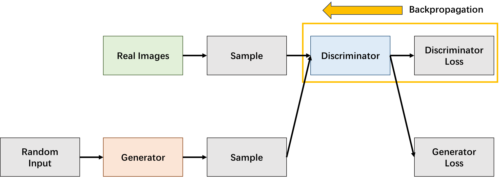

# Generative Adversarial Networks

Link: [Generative Adversarial Networks](https://papers.nips.cc/paper_files/paper/2014/hash/5ca3e9b122f61f8f06494c97b1afccf3-Abstract.html).

> We propose a new framework for estimating generative models via an adversarial process, in which we **simultaneously train two models**: **a generative model G that captures the data distribution, and a discriminative model D that estimates the probability that a sample came from the training data rather than G**. The training procedure for G is to maximize the probability of D making a mistake. This framework corresponds to a ***minimax two-player game***. In the space of arbitrary functions G and D, a unique solution exists, with G recovering the training data distribution and D equal to 1/2 everywhere. In the case where G and D are defined  by multilayer perceptrons, the entire system can be trained with backpropagation. There is no need for any Markov chains or unrolled approximate inference networks during either training or generation of samples. Experiments demonstrate the potential of the framework through qualitative and quantitative evaluation of the generated samples.


## Adversarial Networks

**生成对抗网络**（Generative Adversarial Networks）包含两个部分：

- **生成器**（Generator），用于**捕获真实数据的分布**，以生成尽可能像真实数据的虚假数据。
- **辨别器**（Discriminator），用于**区分**真实数据和由生成器生成的假数据。

生成对抗网络的结构如下图所示：


生成对抗网络的训练过程如下图所示：


假设随机噪声 $z$ 服从**一维均匀分布**，真实数据 $x$ 服从**一维正态分布**，黑色点线表示 $x$ 的概率密度函数，绿色实线表示 $z$ 的概率密度函数，蓝色虚线表示辨别器的辨别密度函数，在 GAN 训练的过程中，生成器**逐渐**学习真实的数据分布，因此由生成器生成的虚假数据的概率密度函数逐渐向真实数据靠近，理论上，生成器可以完全学习到真实数据底层的分布，此时，辨别器就无法区分真实数据和虚假数据了。


### Discriminator

辨别器本质上就是一个**分类器**（Classifier），用于学习真实数据和生成器生成的虚假数据之间的**差异**，尽可能区分真实数据和虚假数据。辨别器的输入数据有**两个来源**：真实数据和生成器生成的虚假数据。



辨别器的**训练过程**：

1. 从一个随机分布中采样一组随机噪声，并从真实数据中采样一组**真实数据样本**。
2. 利用生成器将采样的随机噪声进行转换，获取**虚假数据样本**。
3. 让辨别器分别对真实数据和虚假数据**进行分类**。
4. 计算辨别器损失，并执行反向传播获得梯度，**更新辨别器的权重**。


### Generator

生成器用于学习真实数据的底层数据分布，以生成可信的数据，**尽可能骗过辨别器**。


生成器的训练过程如下：

1. 从一个随机分布中采样一组随机噪声。
2. 利用生成器将采样的随机噪声进行转换，获取**虚假数据样本**。
3. 让辨别器对这一组虚假数据进行分类，获取分类结果。
4. 计算辨别器损失，并执行反向传播获得梯度，**更新生成器的权重**。


### Training Algorithm

生成对抗网络的训练算法如下图所示：


## PyTorch Implementation

GAN 的 PyTorch 实现代码如下，下面的代码中，GAN 的生成器和辨别器均定义为**多层感知机**（MultiLayer Perceptron），`train` 函数给出了 GAN 的训练代码。

```python
class Discriminator(nn.Module):
    """
    Disrcminator in GAN.
    
    Model Architecture: [affine - leaky relu - dropout] x 3 - affine - sigmoid
    """
    def __init__(self, image_shape: tuple[int, int, int]) -> None:
        """Initialize Discriminator in GAN.

        Args:
            image_shape(tuple[int, int, int]): shape of image.
        """
        super(Discriminator, self).__init__()
        C, H, W = image_shape
        image_size = C * H * W
        self.model = nn.Sequential(
            nn.Linear(image_size, 512), nn.LeakyReLU(0.2), nn.Dropout(0.3),
            nn.Linear(512, 256), nn.LeakyReLU(0.2), nn.Dropout(0.3),
            nn.Linear(256, 128), nn.LeakyReLU(0.2), nn.Dropout(0.3),
            nn.Linear(128, 1), nn.Sigmoid())

    def forward(self, images: Tensor) -> Tensor:
        """Forward pass in Discriminator.

        Args:
            images(Tensor): input images, of shape (N, C, H, W)

        Returns:
            Tensor: probabilities for input images to be real data, of shape (N, 1).
        """
        images = images.view(images.size(0), -1)
        return self.model(images)


class Generator(nn.Module):
    """
    Generator in GAN.

    Model Architecture: [affine - batchnorm - relu] x 4 - affine - tanh
    """
    def __init__(self, image_shape: tuple[int, int, int], latent_dim: int) -> None:
        """Initialize Generator in GAN.

        Args:
            image_shape(tuple[int, int, int]): shape of image.
            latent_dim(int): dimensionality of the latent space.
        """
        super(Generator, self).__init__()
        C, H, W = image_shape
        image_size = C * H * W
        self.image_shape = image_shape
        self.model = nn.Sequential(
            nn.Linear(latent_dim, 128), nn.BatchNorm1d(128), nn.ReLU(),
            nn.Linear(128, 256), nn.BatchNorm1d(256), nn.ReLU(),
            nn.Linear(256, 512), nn.BatchNorm1d(512), nn.ReLU(),
            nn.Linear(512, 1024), nn.BatchNorm1d(1024), nn.ReLU(),
            nn.Linear(1024, image_size), nn.Tanh())
    
    def forward(self, z: Tensor) -> Tensor:
        """Forward pass in Generator.

        Args:
            z(Tensor): latent variables of shape (N, D) that sample from a distribution.

        Returns:
            Tensor: fake images produced by Generator.
        """
        images: Tensor = self.model(z)
        return images.view(-1, *self.image_shape)

def train(args: Namespace, 
          G: Generator, D: Discriminator, 
          data_loader: DataLoader) -> None:
    """Train Generator and Discriminator.

    Args:
        args(Namespace): arguments.
        G(Generator): Generator in GAN.
        D(Discriminator): Discriminator in GAN.
    """
    writer = SummaryWriter(os.path.join(args.logdir, args.dataset))

    # generate fixed noise for sampling.
    fixed_noise = torch.rand(64, args.latent_dim).to(device)

    # Loss and optimizer.
    criterion = nn.BCELoss().to(device)
    optimizer_G = torch.optim.Adam(G.parameters(), lr=args.lr, betas=(args.beta1, args.beta2))
    optimizer_D = torch.optim.Adam(D.parameters(), lr=args.lr, betas=(args.beta1, args.beta2))

    # Start training.
    for epoch in range(args.num_epochs):
        total_d_loss = total_g_loss = 0
        for images, _ in data_loader:
            m = images.size(0)
            images: Tensor = images.to(device)
            images = images.view(m, -1)
            # Create real and fake labels.
            real_labels = torch.ones(m, 1).to(device)
            fake_labels = torch.zeros(m, 1).to(device)
            # ================================================================== #
            #                      Train the discriminator                       #
            # ================================================================== #

            # Forward pass
            outputs = D(images)
            d_loss_real: Tensor = criterion(outputs, real_labels)
            
            z = torch.rand(m, args.latent_dim).to(device)
            fake_images: Tensor = G(z).detach()
            outputs = D(fake_images)
            d_loss_fake: Tensor = criterion(outputs, fake_labels)

            # Backward pass
            d_loss: Tensor = d_loss_real + d_loss_fake
            optimizer_D.zero_grad()
            d_loss.backward()
            optimizer_D.step()
            total_d_loss += d_loss

            # ================================================================== #
            #                        Train the generator                         #
            # ================================================================== #
            
            # Forward pass
            z = torch.rand(images.size(0), args.latent_dim).to(device)
            fake_images: Tensor = G(z)
            outputs = D(fake_images)
            
            # Backward pass
            g_loss: Tensor = criterion(outputs, real_labels)
            optimizer_G.zero_grad()
            g_loss.backward()
            optimizer_G.step()
            total_g_loss += g_loss
        print(f'''
=====================================
Epoch: [{epoch + 1}/{args.num_epochs}]
Discriminator Loss: {total_d_loss / len(data_loader):.4f}
Generator Loss: {total_g_loss / len(data_loader):.4f}
=====================================''')
        # Log Discriminator and Generator loss.
        writer.add_scalar('Discriminator Loss', total_d_loss / len(data_loader), epoch + 1)
        writer.add_scalar('Generator Loss', total_g_loss / len(data_loader), epoch + 1)
        fake_images: Tensor = G(fixed_noise)
        img_grid = make_grid(denormalize(fake_images), nrow=8, padding=2)
        writer.add_image('Fake Images', img_grid, epoch + 1)
        if (epoch + 1) % args.interval == 0:
            save_image(img_grid, os.path.join(args.sample_dir, args.dataset, f'fake_images_{epoch + 1}.png'))
    # Save the model checkpoints.
    torch.save(G.state_dict(), os.path.join(args.ckpt_dir, args.dataset, 'G.ckpt'))
    torch.save(D.state_dict(), os.path.join(args.ckpt_dir, args.dataset, 'D.ckpt'))
```

