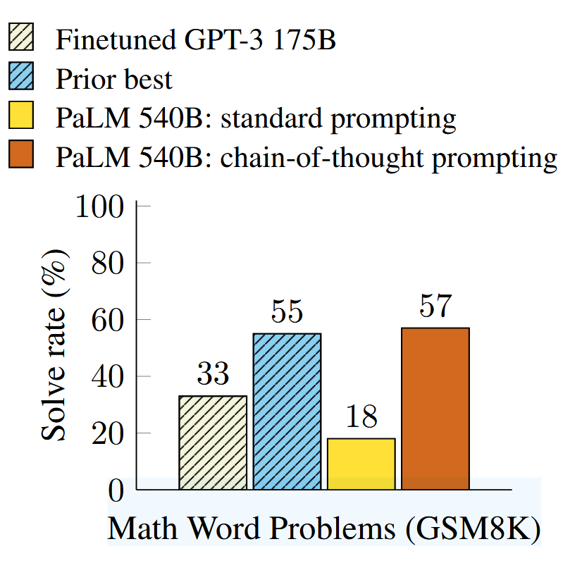
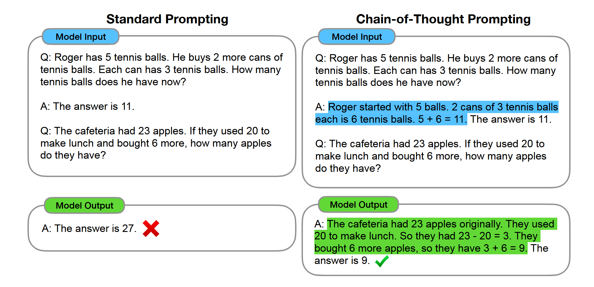
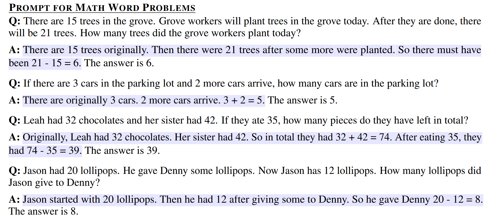

# Chain-of-Thought Prompting

Link: [Chain-of-Thought Prompting Elicits Reasoning in Large Language Models](http://arxiv.org/abs/2201.11903).

> We explore how generating a **chain of thought**—a series of intermediate reasoning steps—significantly improves the ability of large language models to perform complex reasoning. In particular, we show how such reasoning abilities emerge naturally in sufficiently large language models via a simple method called chain-of-thought prompting, where a few chain of thought demonstrations are provided as exemplars in prompting. 
>
> Experiments on three large language models show that chain-of-thought prompting improves performance on a range of arithmetic, commonsense, and symbolic reasoning tasks. The empirical gains can be striking. For instance, prompting a PaLM 540B with just eight **chain-of-thought exemplars** achieves state-of-the-art accuracy on the GSM8K benchmark of math word problems, surpassing even finetuned GPT-3 with a verifier.

## Background

**语言模型**（Languge Models）正在使**自然语言处理**（Natrual Language Processing）的格局发生变革，单纯地扩大模型的规模，就可以获得一系列的收益，比如性能提升。然而，仅仅扩大模型规模对于**推理**（Reasoning）等具有挑战性的任务远远不够。

大语言模型对于上下文内的**少量样本学习**（few-shot learning）的能力很强，因此本文提出了一种方法，称为**思维链提示**（Chain-of-Thought Prompting），通过给定一组**少量的输入-输出范例**，可以使得模型产生思维链，大大提高了问题的解决率。

相对于**标准提示**（Standard Prompting），性能得到了很大的提升，使用 PaLM 540B 模型在 GSM8K 数据集上分别使用标准提示和思维链提示，可以看到思维链提示的准确率**远远高于**标准提示的结果，甚至比面向任务微调的 GPT-3 175B 模型的准确率还要高。

## Chain-of-Thought Prompting

**思维链**指的就是一系列得到最终输出的中间自然语言推理步骤，思维链提示包含三个部分：输入、思维链、输出。下图展示了标准提示和思维链提示的对比：

思维链提示具有如下几种**特性**：

1. 思维链理论上可以让模型将多步问题**分解**为若干个中间步骤。
2. 思维链使得模型的**可解释性**更强。
3. 思维链推理可以应用到任何人类可以通过自然语言解决的任务。
4. 思维链推理可以很容易引入到模型中，只需要通过使用一组**少量的包含思维链的输入-输出范例**提示模型。

下图展示了论文中对于 Math Word Problems 数据集使用的 few-shot exemplars：

根据论文中提供的实验结果，**思维链提示只有在模型的规模达到一定的程度时才能够获得性能提升**。

