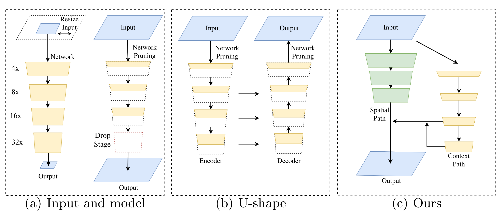
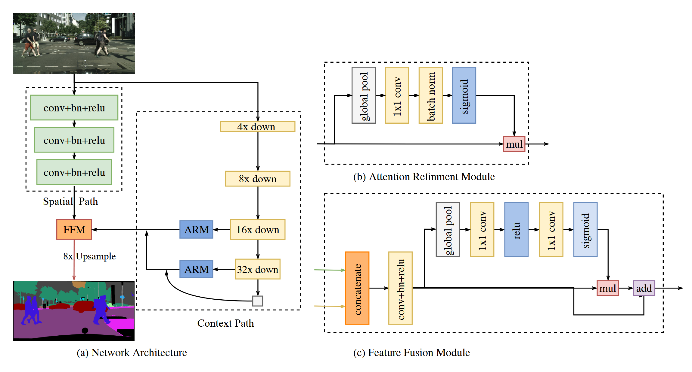
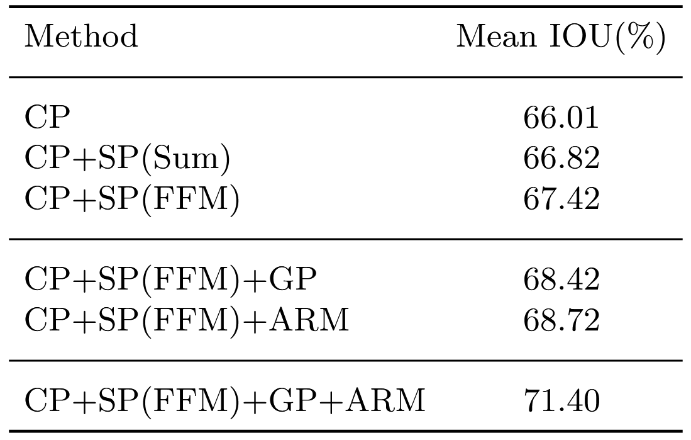
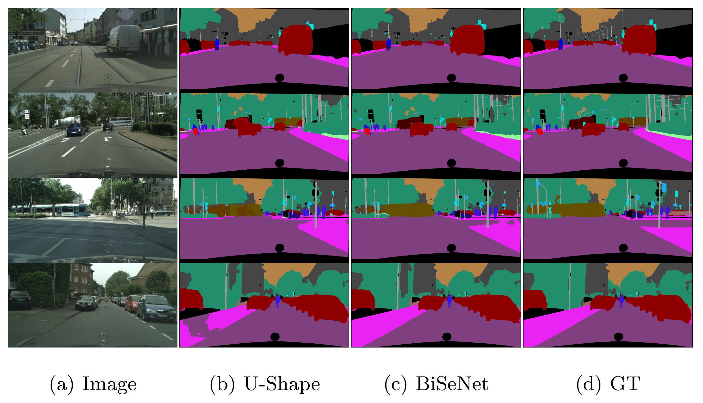
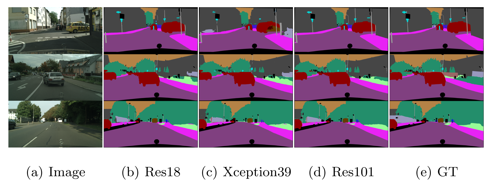

# BiSeNet

Link: [BiSeNet: Bilateral Segmentation Network for Real-time Semantic Segmentation](http://arxiv.org/abs/1808.00897).

> Semantic segmentation requires both **rich spatial information** and **sizeable receptive field**. However, modern approaches usually compromise spatial resolution to achieve real-time inference speed, which leads to poor performance. In this paper, we address this dilemma with a novel **Bilateral Segmentation Network** (BiSeNet). We first design a **Spatial Path** with a small stride to preserve the spatial information and generate high-resolution features. Meanwhile, a **Context Path** with a fast downsampling strategy is employed to obtain sufficient receptive field. On top of the two paths, we introduce a new **Feature Fusion Module** to combine features efficiently. The proposed architecture makes a right balance between the speed and segmentation performance on Cityscapes, CamVid, and COCO-Stuff datasets. Specifically, for a 2048×1024 input, we achieve 68.4% Mean IOU on the Cityscapes test dataset with speed of 105 FPS on one NVIDIA Titan XP card, which is significantly faster than the existing methods with comparable performance.

## Background

**语义分割**（Semantic Segmentation）的目标是为每一个像素分配一个语义标签，是计算机视觉中的一项基本任务。语义分割可以广泛应用于自动驾驶（autonomous driving）、视频监控（video surveillance）等领域，这些应用程序对高效的**推理速度**有很高的要求，以实现**快速交互或响应**。

在 BiSeNet 之前，实时语义分割算法主要包含三种方法：

1. 通过**限制输入图片的大小**来降低计算的复杂度。
2. 通过**降低网络的通道数**来提高推理速度。
3. **丢弃**模型的最后一层。

上述的方法都以**牺牲分割的准确性为代价**来提高实时分割推理速度。

- 方法 1 简单且有效，但是**损失了大量的空间信息**（Spatial Information），导致分割的结果不准确，特别是边界附近。
- 方法 2 通过修建网络通道数，一定程度上会损失空间信息。
- 方法 3 丢弃了最后一个阶段的降采样操作，导致模型的**感受野**（Receptive Field）不足以覆盖大的物体。

U 型结构（U-Net）一定程度上可以修正上述方法损失的空间信息，但是完整的 U 型结构由于需要处理额外的高分辨率的特征图，会**降低模型的推理速度**，此外，在网络修剪（network pruning）损失的大部分的空间信息不能简单地通过结合浅层的输出恢复。

**充分的空间信息**和**足够大的感受野**对于语义分割的精确性是至关重要的，基于以上的观察，作者提出**双边分割网络**（BiSeNet），BiSeNet 包含两个路径：**空间路径**（Spatial Path）和**上下文路径**（Context Path），分别用来解决空间信息的损失和感受野大小的问题。此外，作者提出了**特征融合模块**（Feature Fusion Module）和**注意力细化模块**（Attention Refinement Module）来获取更好的分割精度。

## Model Architecture

BiSeNet 模型结构如下图所示：

### Spatial Path and Context Path

**空间路径**：编码**丰富的空间信息**，包含三个层，每个层的结构均为：conv - bathnorm - relu，其中**卷积层的步长为 2**，经过空间路径，得到原图 **1/8** 空间维度大小的特征图。

**上下文路径**：使用**轻量级模型**（Xception）以及全局平均池化来获取足够大的感受野，轻量级模型可以快速地降采样特征图获得高级**语义信息**，在模型的最后一层**添加一个全局平均池化层，以最大化感受野**，最后，将全局池化的特征图进行采样的结果与轻量级模型的输出特征图进行融合。

### ARM and FFM

**注意力细化模块**：用于细化每一个阶段的特征，ARM 采用**全局平均池化**来捕获全局上下文并计算注意力向量来指导特征学习，这种设计可以细化上下文路径中每个阶段的输出特征。

**特征融合模块**：空间路径和上下文路径输出的特征图具有**不同的特征表示级别**，空间路径包含丰富的空间信息（低级特征），上下文路径包含丰富的语义信息（高级特征），因此不能简单地进行累加。首先将两个路径输出特征图经过一层 conv - **batchnorm** - relu，通过批量归一化（Batch Normalization）使得不同维度的特征具有相近的规模。然后将连接的特征图进行**全局平均池化**，获得一个特征向量，然后计算一个**权重向量**，这个权重向量可以对特征进行重新加权，相当于特征的选择和组。。

### Loss functions

BiSeNet 使用交叉熵函数（Cross Entropy）作为损失函数，同时也使用**辅助损失**（Auxiliary Loss），辅助损失基于第 2 阶段和第 3 阶段 Xception 的输出，完整的损失函数形式如下：
$$
L(X;W)=l_p(X;W)+\alpha \sum_{i=2}^Kl_i(X_i;W)
$$
其中 $\alpha$ 为**辅助损失的权重**，在 BiSeNet 的实验中设定为 1。

## Experiment

作者进行了广泛的融合研究，表明**空间路径、注意力细化模块、特征融合模块、全局平均池化可以提高模型的性能**，即提高分割预测的准确度。

下图为添加空间路径之前（b）和添加空间路径之后（c）的输出结果示例，BiSeNet 的输出比 U-shape 的输出有**更多的细节信息**。

下面给出了 BiSeNet 对上下文路径使用不同的骨干网络的一些例子，可以看到使用**轻量级模型** Xception39 的分割结果是不错的因此 BiSeNet 使用了 Xception 作为骨干网络以提高模型的推理速度，满足实时分割的需求。

