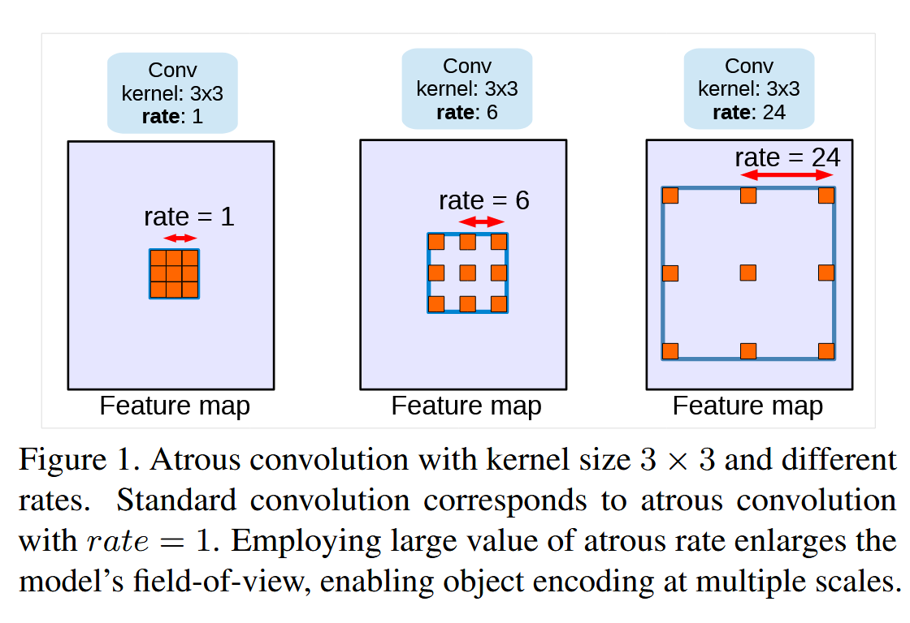

# DeeplabV3

Link: [Rethinking Atrous Convolution for Semantic Image Segmentation](http://arxiv.org/abs/1706.05587).

> In this work, we revisit **atrous convolution**, a powerful tool to **explicitly adjust filter’s field-of-view** as well as control the resolution of feature responses computed by Deep Convolutional Neural Networks, in the application of semantic image segmentation. To handle the problem of segmenting objects at multiple scales, we design modules which employ atrous convolution in cascade or in parallel to capture multi-scale context by adopting multiple atrous rates. Furthermore, we propose to augment our previously proposed **Atrous Spatial Pyramid Pooling module**, which probes convolutional features at multiple scales, with image-level features encoding global context and further boost performance. We also elaborate on implementation details and share our experience on training our system. The proposed ‘**DeepLabv3**’ system significantly improves over our previous DeepLab versions without DenseCRF post-processing and attains comparable performance with other state-of-art models on the PASCAL VOC 2012 semantic image segmentation benchmark.


## Background

应用深度卷积神经网络完成 **语义分割**（Semantic Segmentation）任务面临着两个挑战：

1. 通过连续的池化操作或者步长大于 1 的卷积，会使得特征图的**分辨率降低**（resolution reduction），目的是提取高级的语义特征，但是**损失了大量的空间信息**，这对于密集的分割预测任务来说是不利的。
2. 存在**多个尺度**（multi-scale）的物体，即图片中物体的规模大小不一。

通过应用**空洞卷积**（Atrous Convolution）可以缓解第一个问题。4 种常见的语义分割网络结构用于解决多尺度的问题。

- **图像金字塔**（Image Pyramid）：将图片以不同的比例缩放，输入到模型中，得到的结果进行合并。
- **编码器-解码器**（Encoder-Decoder）：利用编码器中不同尺度的特征来**恢复空间信息**。
- **空洞卷积**：通过扩大空洞率，在保持**特征图分辨率不变**（防止空间信息损失）的前提下，使得感受野也随之扩大。


### Atrous Convolution

**空洞卷积**，也称为**膨胀卷积**（Dilation Convolution），通过控制**膨胀率**（dilation rate）可以获得不同的**感受野**（receptive field），膨胀率越大，感受野越大。

空洞卷积的操作如下图所示，所谓的空洞卷积，实际上就是**扩大卷积核的大小**，从而增加感受野的大小，但**不增加**卷积核的参数数量，卷积核的参数均匀地分布到扩大的卷积核上，**空洞的部分参数填充为0**，因此这种卷积方式称为空洞卷积，可以视为标准卷积的推广。**注意**：膨胀率为 1 的空洞卷积**等价于**标准卷积操作。



在 PyTorch 实现空洞卷积非常简单，只需要使用指定 `dilation` 参数的 `nn.Conv2d` 模块即可：

```python
# dilation rate.
dilation = 2
conv = nn.Conv2d(in_channels, out_channels, 
                 kernel_size=kernel_stride, stride=stride, 
                 padding=padding, dilation=dilation)
```


