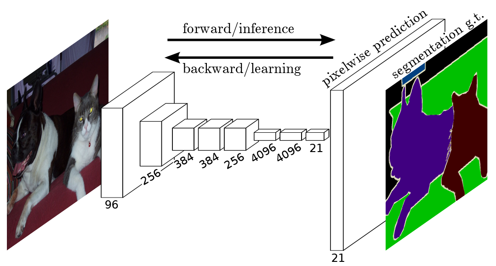
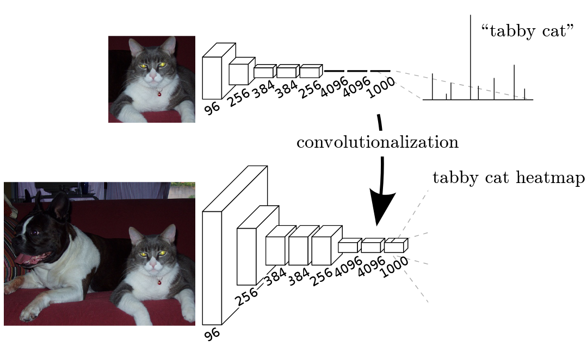
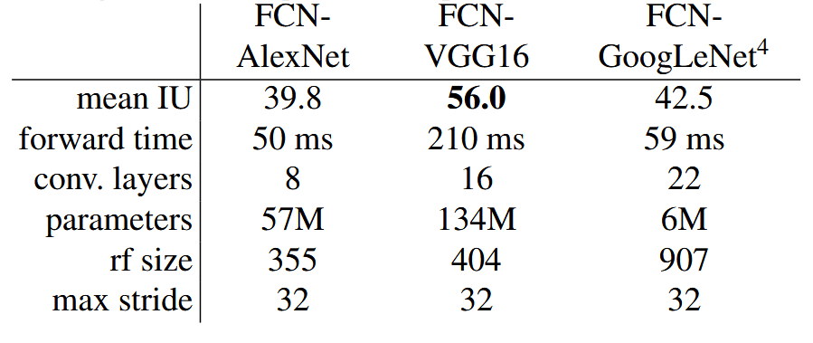
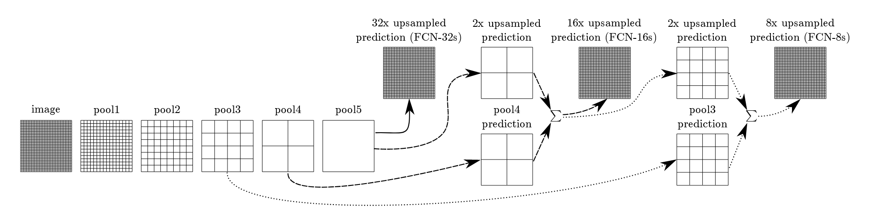

# Fully Convolutional Networks

Link: [Fuuly Convolutional Networks for Semantic Segmentation](http://arxiv.org/abs/1411.4038).

> Convolutional networks are powerful visual models that yield hierarchies of features. We show that convolutional networks by themselves, trained end-to-end, pixels-to-pixels, exceed the state-of-the-art in semantic segmentation. Our key insight is to build **“fully convolutional” networks** that take input of arbitrary size and produce correspondingly-sized output with efficient inference and learning. We define and detail the space of fully convolutional networks, explain their application to spatially dense prediction tasks, and draw connections to prior models. We adapt contemporary classification networks (AlexNet [19], the VGG net [31], and GoogLeNet [32]) into fully convolutional networks and transfer their learned representations by **fine-tuning** [4] to the segmentation task. We then define a **novel architecture** that combines semantic information from a deep, coarse layer with appearance information from a shallow, fine layer to produce accurate and detailed segmentations. Our fully convolutional network achieves state-of-the-art segmentation of PASCAL VOC (20% relative improvement to 62.2% mean IU on 2012), NYUDv2, and SIFT Flow, while inference takes less than one fifth of a second for a typical image.

## Background

**语义分割**（Semantic Segmentation）的目标是将图像中的每个像素分配一个类别标签，从理解图像中每个像素点属于哪个对象或场景的哪个部分。下图展示了**全卷积神经网络**（Fully Convolutional Networks）总体结构，通过多层卷积提取图像特征，最后通过一个上采样（Upsampling）或者反卷积（Deconvolution）扩大特征图的大小，最终输出结果的形状在**空间维度**上与输入图片的大小相同，其**通道维度**上与像素类别总数相同。

语义分割本质上就是一个**分类**（Classification）任务，只不过与传统的图像分类任务不同，不是对整张图片分配一个标签，而是对每一个像素分配一个标签，语义分割模型训练时需要有原图以及对应的真实分割图（Ground Truth）。训练分割模型，最基本的方式就是使用**交叉熵函数**（Cross Entropy）作为损失函数，通过模型的前向传播获取**分割预测结果**，根据 groud truth 和分割预测结果计算损失，执行反向传播获得梯度，并通过梯度更新分割模型参数。

## Segmentation Architecture

基于 [AlexNet](https://papers.nips.cc/paper_files/paper/2012/hash/c399862d3b9d6b76c8436e924a68c45b-Abstract.html)、[VGGNet](http://arxiv.org/abs/1409.1556)、[GoogLeNet](https://arxiv.org/abs/1409.4842)，将这些分类模型的**全连接层**卷积化，即可得到全卷积神经网络 FCN，最后使用一个反卷积层扩大特征图大小，获取分割预测结果。

最终得到的实验结果如下表所示：

可以看到基于 VGG-16 的 FCN 的**平均交并比**（mean Intersection over Union, mean IoU）最高，在后面的 FCN 设计中，就是基于 VGG-16 网络的。

### Skip Architecture

论文中提出了一种**跳跃结构**（Skip Architecture），用于将深层的粗略的**语义信息**与浅层的精细的**外观信息**结合起来，以产生更加精细的结果，共有三个版本：FCN-32s、FCN-16s、FCN-8s。

- **FCN-32s** 将第 5 层输出（原图大小的 1/32）的结果进行 **32 倍的上采样**，使用**步长为 32 的反卷积**实现。

- **FCN-16s** 将第 5 层输出结果进行 **2 倍上采样**，将第 4 层的输出（原图大小的 1/16）通过一个 1x1 的卷积**使其特征图的通道数等于总像素类别数**后，直接将两个结果按元素（elementwise）相加，得到分割预测结果。
- **FCN-8s** 在 FCN-16s 的基础上，使用了第 3 层的输出结果，具体来说将第 5 层输出结果进行 ，**2 倍上采样** 与经过 1x1 卷积后的第 4 层输出的结合结果再次进行 **2 倍上采样**，得到的结果与经过 1x1 卷积后的第 3 层输出结果结合起来，得到分割预测结果。

FCN 的官方**代码链接**：https://github.com/shelhamer/fcn.berkeleyvision.org

FCN-32s、FCN-16s 和 FCN-8s 不会重头开始训练模型，它们都使用了**预训练**的 VGG-16 模型，丢弃

