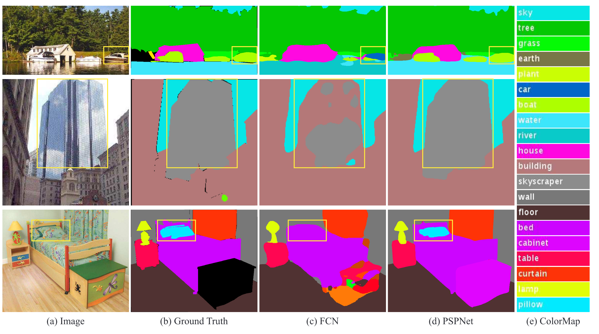
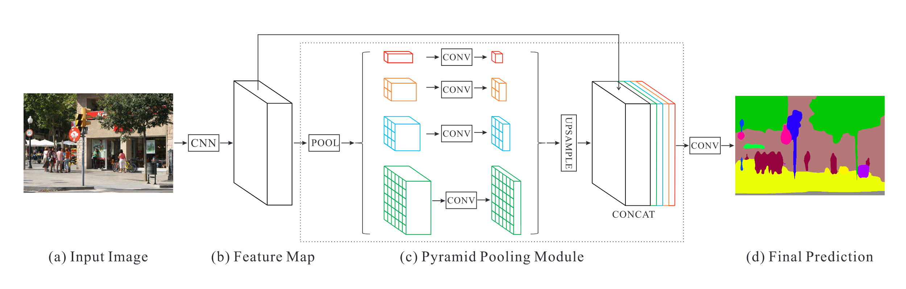

# PSPNet

Link: [Pyramid Scene Parsing Network](http://arxiv.org/abs/1612.01105).

> **Scene parsing** is challenging for unrestricted open vocabulary and diverse scenes. In this paper, we exploit the capability of **global context information** by different-region based context aggregation through our pyramid pooling module together with the proposed pyramid scene parsing network (PSPNet). Our global prior representation is effective to produce good quality results on the scene parsing task, while PSPNet provides a superior framework for pixel-level prediction. The proposed approach achieves state-of-the-art performance on various datasets. It came first in ImageNet scene parsing challenge 2016, PASCAL VOC 2012 benchmark and Cityscapes benchmark. A single PSPNet yields the new record of mIoU accuracy 85.4% on PASCAL VOC 2012 and accuracy 80.2% on Cityscapes.

## Background

**场景解析**（Scene Parsing）的目标是为每一个像素分配一个类别标签，场景解析的难度与场景和标签的多样性紧密相关。在**金字塔场景解析网络**（PSPNet）这篇论文之前，场景解析框架大部分都基于[**全卷积神经网络**](http://arxiv.org/abs/1411.4038)（FCN），但是 FCN 并没有考虑**上下文信息**（Context Information），导致分割的结果产生错误。

在 ADE20K 数据集上作者观察到的一些场景解析的相关问题：

1. **不匹配的关系**（Mismatched Relationship）。上下文关系是普遍且重要的，尤其是对于复杂的场景理解，存在**同时出现的视觉模式**。例如：一架飞机很可能会出现在跑道上或者天空中。对于下图的第一行，FCN 将黄色框部分的小船（boat）**仅仅依靠于其外观和形状**将其预测为汽车（car），而一辆汽车通常不会在河上（**上下文信息**），FCN 缺乏考虑上下文信息的能力，会导致误分类的可能性增加。
2. **易混淆的类别**（Confusion Categories）。在 ADE20K 数据集存在许多相近的标签，例如摩天大楼（skyscraper）、建筑（building）和房子（house）。对于下图的第二行，FCN 将黄色框部分的**摩天大楼**一部分预测为**建筑**（building），另一部分则正确预测。
3. **不明显的类别**（Inconspicuous Classes）。正确分割一些形状相对较小的物体是很有挑战性的。对于下图的第三行，由于其外观与床单非常相似，FCN 将黄色框部分的枕头（pillow）预测为了床（bed）。

上述的问题部分或者完全与忽略上下文信息有关。

## Model Architecture

PSPNet 的模型结构如下，首先使用一个 CNN（例如：ResNet、HRNet）提取输入图像特征，获得最后一层卷积输出的特征图，将此特征图进行金字塔池化（Pyramid Pooling），使用**四种规模的池化**，再将池化结果通过 **1x1 卷积**调整其通道维度大小，最后进行一次**上采样**使其空间维度恢复到原特征图大小，与原特征图结合起来进行一次卷积，得到分割预测结果。

**金字塔池化模块**（Pyramid Pooling Module）融合了四种不同金字塔尺度下的特征，以红色突出显示的最粗略的级别是**全局池化**（Global Average Pooling），用于生成单个 bin 输出，PSPNet 中使用了四种级别，分别产生的 bin 的大小为 1x1、2x2、3x3、6x6，对于不同级别，在原特征图经过池化层后需要进行一次 1x1 的卷积，使得**通道维度减小为原来的 1/N**（N 为所处的金字塔层级），然后通过**双线性插值**（Bilinear Interpolation）恢复原来的空间维度大小，与原始的特征图结合起来。

