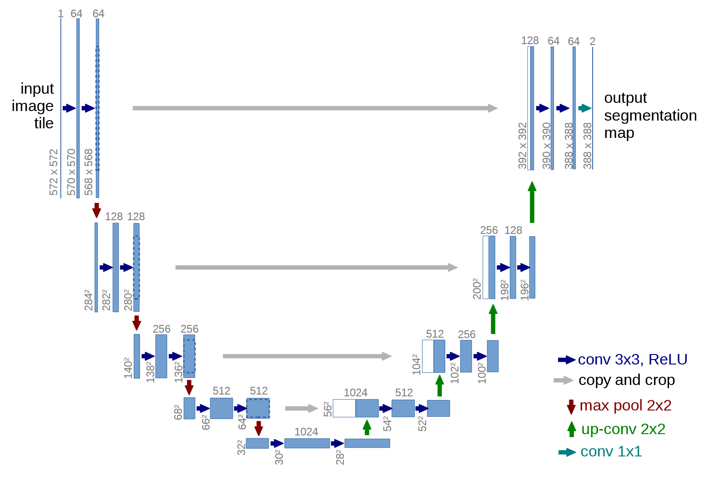

# U-Net

Link: [U-Net: Convolutional Networks for Biomedical Image Segmentation](http://arxiv.org/abs/1505.04597).

> There is large consent that successful training of deep networks requires many thousand annotated training samples. In this paper, we present a network and training strategy that relies on the strong use of data augmentation to use the available annotated samples more efficiently. The architecture consists of a **contracting path** to capture context and a **symmetric expanding path** that enables precise localization. We show that such a network can be trained end-to-end from very few images and outperforms the prior best method (a sliding-window convolutional network) on the ISBI challenge for segmentation of neuronal structures in electron microscopic stacks. Using the same network trained on transmitted light microscopy images (phase contrast and DIC) we won the ISBI cell tracking challenge 2015 in these categories by a large margin. Moreover, the network is fast. Segmentation of a 512x512 image takes less than a second on a recent GPU. The full implementation (based on Caffe) and the trained networks are available at http://lmb.informatik.uni-freiburg.de/people/ronneber/u-net.


## Model Architecture

U-Net 的模型结构如下图所示，U-Net 是一个非常优雅的网络，具有对称性。左侧为**压缩路径**（contracting path），右侧为**扩张路径**（expansive path），每一阶段使用两个步长为 1 的 3x3 卷积，并通过一个步长为 2 的 2x2 最大池化层进行降采样，降采样的次数为 4 次。在右侧扩张路径中，首先对前一层的输出进行 **2 倍上采样**，扩大特征图的大小，然后**与左侧压缩路径对应阶段的输出结合起来**，再进行两个步长为 1 的 3x3 卷积。最后得到的特征图（64维）再通过一次 **1x1 的卷积**，使得通道维度与总像素的类别数一致。



由于两者的**特征图空间维度可能不一致**，可能需要对左侧对应阶段的输出进行裁剪，或者对右侧阶段的上采样输出结果进行填充，在上面的例子中采用的方式为对左侧输出进行裁剪。


## PyTorch Implementation

U-Net 的 PyTorch 实现代码如下，在这个版本的 U-Net 实现中，输入的图片和输出的分割预测结果的空间维度是相同的，因为在右侧扩展路径与左侧对应阶段输出的结合，采用了填充的方式，具体代码参考了 **milesial** 的实现，github 仓库链接：https://github.com/milesial/Pytorch-UNet。

```python
import torch
from torch import nn, Tensor

class UNet(nn.Module):
    """U-Net."""
    def __init__(self, num_channels: int) -> None:
        """Initialize U-Net.
        
        Args:
            num_channels(int): number of channels.
        """
        super(UNet, self).__init__()
        self.in_conv = DoubleConv(num_channels, 64)
        self.down1 = DownBlock(64, 128)
        self.down2 = DownBlock(128, 256)
        self.down3 = DownBlock(256, 512)
        self.down4 = DownBlock(512, 1024)
        self.up1 = UpBlock(1024, 512)
        self.up2 = UpBlock(512, 256)
        self.up3 = UpBlock(256, 128)
        self.up4 = UpBlock(128, 64)
        self.out_conv = nn.Conv2d(64, num_channels, kernel_size=1, stride=1)
        self.tanh = nn.Tanh()

    def forward(self, z: Tensor) -> Tensor:
        """Forward pass in U-Net.
        
        Args:
            z(Tensor): latent variables of shape (N, C, H, W). 
        
        Returns:
            Tensor: fake images of shape (N, C, H, W) produced by generator.
        """
        # contracting path
        x1 = self.in_conv(z)
        x2 = self.down1(x1)
        x3 = self.down2(x2)
        x4 = self.down3(x3)
        out = self.down4(x4)
        # expansive path
        out = self.up1(out, x4)
        out = self.up2(out, x3)
        out = self.up3(out, x2)
        out = self.up4(out, x1)
        out = self.out_conv(out)
        out = self.tanh(out)
        return out
        

class UpBlock(nn.Module):
    """UpBlock in U-Net."""
    def __init__(self, in_channels: int, out_channels: int) -> None:
        """Initialize a UpBlock in U-Net.
        
        Args:
            in_channels(int): number of channels of input feature map.
            out_channels(int): number of channels of output feature map.
        """
        super(UpBlock, self).__init__()
        self.up = nn.ConvTranspose2d(in_channels, in_channels // 2, kernel_size=2, stride=2)
        self.conv = DoubleConv(in_channels, out_channels)
    
    def forward(self, x1: Tensor, x2: Tensor) -> Tensor:
        x1 = self.up(x1)
        x = torch.cat([x2, x1], dim=1)
        diff_y = x2.size()[2] - x1.size()[2]
        diff_x = x2.size()[3] - x1.size()[3]

        x1 = F.pad(x1, [diff_x // 2, diff_x - diff_x // 2,
                        diff_y // 2, diff_y - diff_y // 2])
        return self.conv(x)


class DownBlock(nn.Module):
    """DownBlock in U-Net."""
    def __init__(self, in_channels: int, out_channels: int) -> None:
        """Initialize a DownBlock in U-Net.
        
        Args:
            in_channels(int): number of channels of input feature map.
            out_channels(int): number of channels of output feature map.
        """
        super(DownBlock, self).__init__()
        self.down = nn.MaxPool2d(kernel_size=2, stride=2)
        self.conv = DoubleConv(in_channels, out_channels)
    
    def forward(self, x: Tensor) -> Tensor:
        out = self.down(x)
        out = self.conv(out)
        return out


class DoubleConv(nn.Module):
    """DoubleConv block.
    
    Architecutre: [conv - batchnorm - relu] x 2
    """
    def __init__(self, in_channels: int, out_channels: int) -> None:
        super(DoubleConv, self).__init__()
        self.double_conv = nn.Sequential(
            nn.Conv2d(in_channels, out_channels, kernel_size=3, padding=1), 
            nn.BatchNorm2d(out_channels), 
            nn.ReLU(),
            nn.Conv2d(out_channels, out_channels, kernel_size=3, padding=1), 
            nn.BatchNorm2d(out_channels), 
            nn.ReLU())
    
    def forward(self, x: Tensor) -> Tensor:
        return self.double_conv(x)
```

